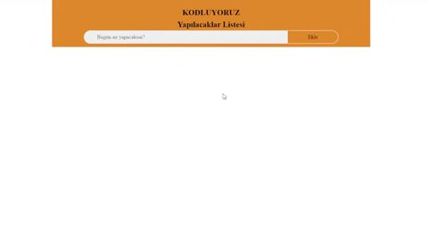

<h1> Patika.dev JS Odev 2</h1>

<h2> A simple Gif about my project</h2>

<h3> I dont use bootstrap for the alerts, i create them with css toggle and js setTimeout(). </h3>

<h1> 02.07.2022 Edit Notes; </h1>
<ul>
    <li> Old build was poorly coded for storage, it can now be stored on demand.  </li>
    <li>In the previous build, the elements did not have IDs, so the eventlisteners were working bad. </li>
</ul>
